# Data Center Sustainability Report 
## 1. Introduction

Middlebury College has long been a leader in sustainability, yet its growing data centers are an often-overlooked part of its energy and emissions profile. This analysis explores a scenario-based model: what if Middlebury’s data centers were powered by a 750 kW solar array dedicated solely to their energy needs? Using a year of simulated data, I assessed how this system could influence grid reliance, emissions, and operating costs. The goal is to identify areas for optimization and demonstrate potential environmental and cost-saving impacts.

**Tools used**: `pandas`, `matplotlib`, `seaborn`, `scikit-learn`

---
## 2. Results and Findings

## Monthly Trends

This section explores how energy use, renewable generation, and emissions vary month-to-month. By visualizing grid energy use, solar output, and CO₂ emissions (national and local), we gain a comprehensive view of sustainability performance over the year.

### Grid Energy Use per Month
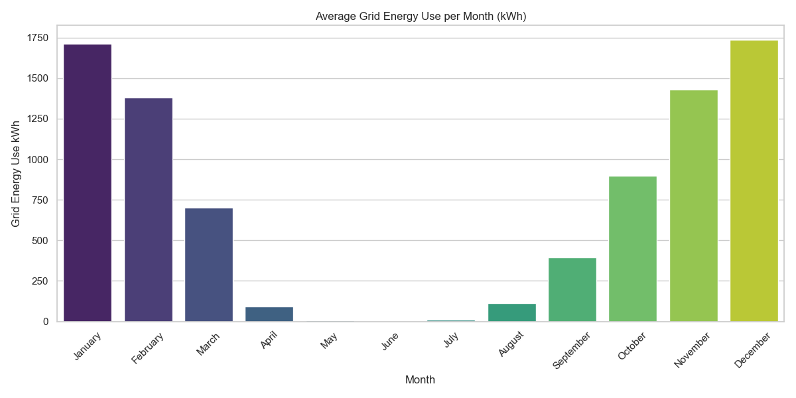
Grid energy use is highest in January, February, November, and December, and significantly lower from May through August—nearly flatlining during peak summer.
High grid use in winter months suggests heavier reliance on external energy sources, likely due to reduced solar output and higher demand (e.g., heating or cooling loads). Summer months show minimal grid usage, indicating strong renewable coverage or lower demand.
There’s a strong seasonal dependency on the grid, with winter months representing a clear opportunity for either:
    Improving solar capacity or storage
    Shifting demand through energy efficiency or scheduling

### Solar Output per Month
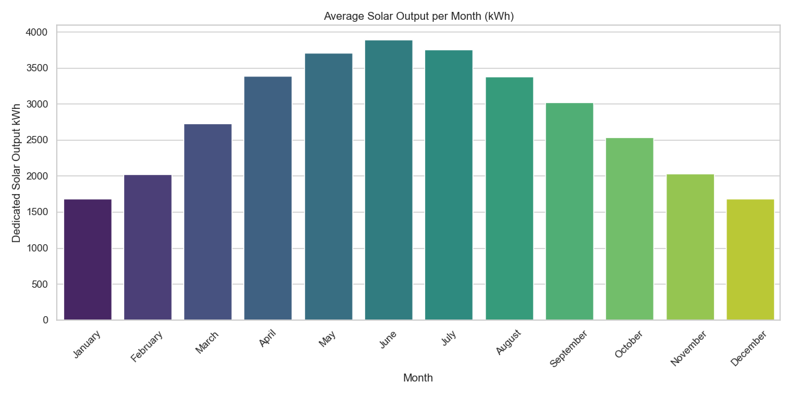
Solar output climbs steadily from January, peaks around June, and gradually declines toward December. This curve aligns well with typical seasonal solar irradiance patterns in the Northern Hemisphere.
The inverse relationship with grid use (i.e., when solar is high, grid use is low) confirms solar as the primary driver of grid independence.
This validates that solar is effectively offsetting grid demand. However, to fully optimize winter performance, solar generation capacity or battery storage may need to be augmented.

### CO₂ Emissions per Month (US_avg)
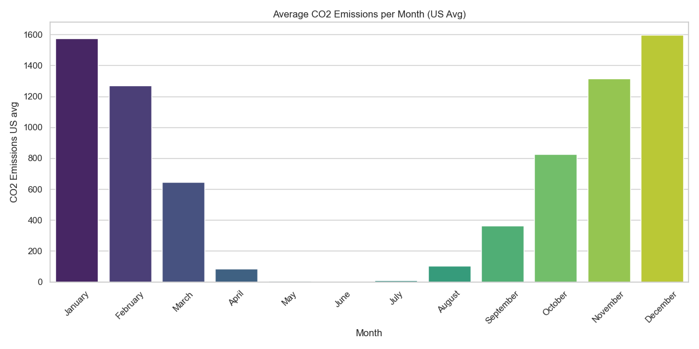
CO₂ emissions follow the same trajectory as grid energy use: high in January–March and November–December, and very low in May–August.
This further confirms the environmental cost of grid reliance, especially in colder months.
Sustainability efforts like demand shaping or load balancing should target winter months to maximize emission reductions.

### CO₂ Emissions per Month(VT-avg)
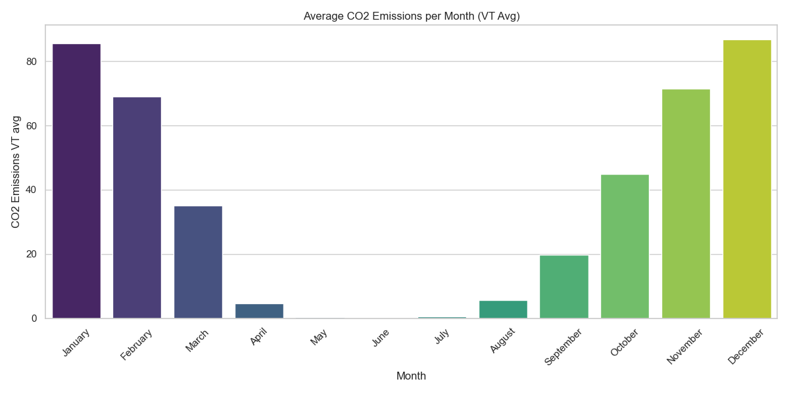
Emissions are dramatically lower than the US average, peaking at ~87 kg CO₂ in January compared to ~1600 nationally.
This reflects Vermont’s cleaner electricity mix (mostly renewable or hydro). While grid use still drives emissions, the marginal cost to the climate is much lower than in fossil-heavy regions.
Site location significantly affects sustainability impact. Siting in clean-grid states like Vermont amplifies the benefits of renewables and reduces the carbon cost of occasional grid fallback.

## Cross-Month comparison & Correlation
These heatmaps provide a powerful summary of seasonal dynamics and relationships between sustainability metrics.

### Monthly Comparison of Key Energy Metrics
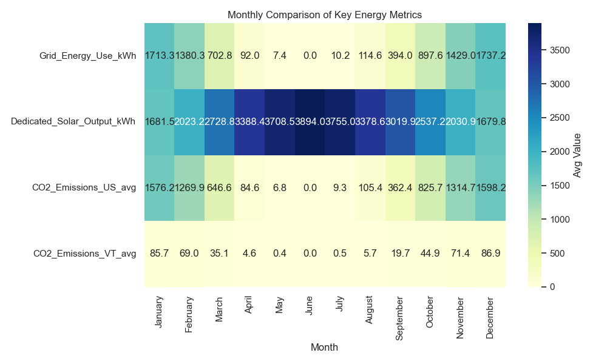
This heatmap displays the average value of key metrics (Grid Energy Use, Solar Output, CO₂ Emissions US/Vermont) across all months.
    *Grid energy use is highest in January, February, November, and December, and essentially zero in May–July.
    Solar output peaks from April through August, with the highest values in June and July.
    CO₂ emissions (US and VT) show a matching dip in summer, with US averages spiking dramatically when grid use is high.   
    Vermont emissions are consistently low but still track grid dependency patterns.
What it means:
    The data center is effectively decoupled from the grid during peak solar months, demonstrating excellent solar penetration.
    CO₂ emissions are nearly eliminated mid-year, confirming the emissions-reduction potential of solar.
    Winter months expose the system’s vulnerability—grid use returns and emissions increase when solar falls off.

### Correlation Between Monthly Averages
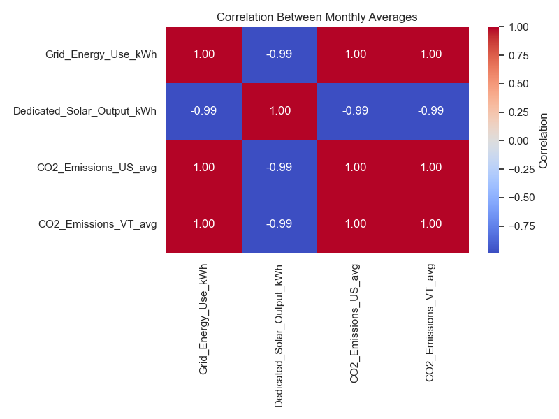

This correlation matrix quantifies the linear relationships between all monthly-averaged metrics.

Key takeaways:
    Perfect positive correlation (1.00) between: Grid energy use ↔ CO₂ emissions (both US and VT)
    Strong negative correlation (~ -0.99) between: Grid energy use ↔ Solar output and Solar output ↔ Emissions

This means:
    Grid use is the primary driver of emissions.
    Solar output is the dominant driver of grid independence and emissions reduction.
    The system is behaving as expected — the more solar available, the less grid needed, and the fewer emissions generated.

---
These heatmaps confirm that the energy and environmental performance of the data center is tightly linked to seasonal solar availability. Investing in battery storage or diversifying renewable inputs could flatten winter dependencies, closing the sustainability gap.

---

### Cumulative Impact

This visualization reveals how the benefits of renewable integration and optimized system behavior add up over time, showing the long-term sustainability trajectory of the data centers.
For every day of the year, I computed and tracked:
Grid Energy Avoided (kWh)
→ How much energy was sourced from solar instead of the grid

Emissions Avoided (kg CO₂)
→ How much carbon would have been emitted if all energy had come from the U.S. grid

Cost Savings ($)
→ Money saved by avoiding expensive grid electricity

These metrics are cumulatively summed over time to show their growing effect.

### Cumulative Impact Over the Year
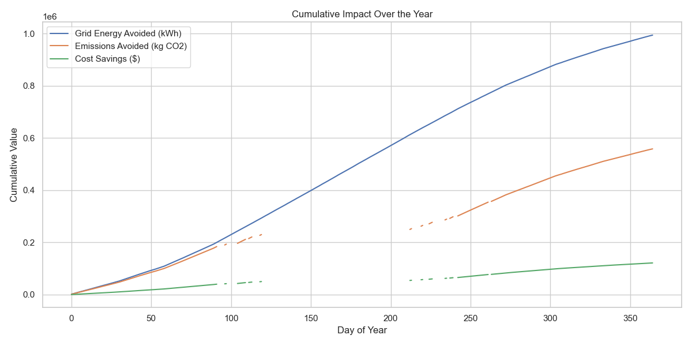

The blue line representing grid energy avoided grows steadily across the year, reaching close to 1 million kWh by year’s end. The orange line, which tracks emissions avoided, closely mirrors the blue line in shape, surpassing 500,000 kg of CO₂ avoided over the same period. The green line, showing cost savings, increases at a slower but consistent rate, ending the year with approximately $120,000 saved. Each line shows steeper growth during the spring and summer months when solar energy availability is at its highest and flattens slightly during the winter months when reliance on grid energy increases.

This cumulative view shows how small daily reductions in grid reliance, driven by renewables and efficiency, build into major yearly gains. Emissions avoided closely mirror grid energy avoided, underscoring how reducing grid dependence directly cuts carbon footprints. While cost savings grow more gradually, they remain significant and justify clean energy investments. For data centers, strategies like aligning workloads with solar peaks or adding storage can further amplify these benefits, and scaling such approaches globally could greatly reduce emissions and costs across the industry.

---

## Key Threshold Days
These scatterplots identify and highlight three critical operational thresholds for the data centers: days with very high grid energy use, days achieving 100% renewable energy coverage, and days with spikes in Power Usage Effectiveness (PUE). Each threshold reflects important sustainability or efficiency milestones and stress points, providing deeper insight into operational performance across the year.

### High Grid Use Days
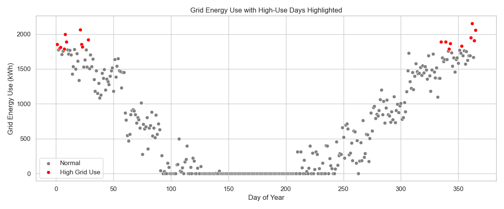

This plot isolates the days when grid energy use exceeded the 95th percentile, marking them in red.

High grid-use days are clustered primarily in the first quarter (January–March) and the last quarter (October–December) of the year. These periods correspond to lower solar availability, forcing greater reliance on the grid.

The clustering shows that seasonal variability in renewable generation drives grid dependence. These are the periods when energy resilience is most vulnerable, underscoring the importance of strategies like battery storage or alternative renewables to smooth out seasonal gaps.

### 100% Renewable Days
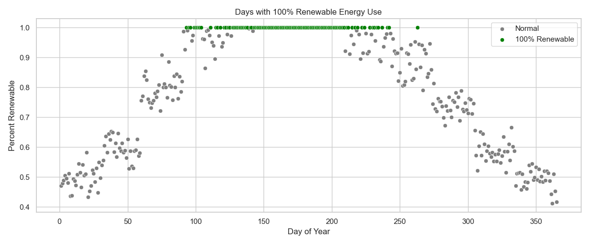

This plot highlights days where the data center operated entirely on renewable energy (green markers).

A dense stretch of days achieving 100% renewable coverage occurs in late spring through early autumn (roughly May–September). Few or no such days appear in the colder, cloudier months.

This is a clear validation of the solar system’s ability to support full operations during high-sunlight seasons. Achieving 100% renewable coverage during these months significantly reduces emissions and costs. However, the absence of these days in the winter reinforces the same seasonal vulnerability observed in the high grid-use plot.

### PUE Spike Days
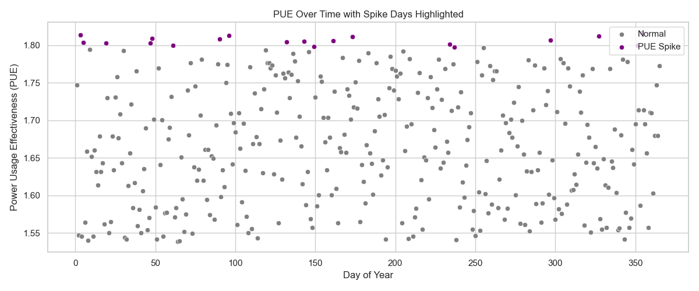

This final scatterplot shows days where PUE (Power Usage Effectiveness) exceeded the 95th percentile, marked in purple. PUE measures how efficiently energy is used, with higher numbers indicating inefficiency.

PUE spikes occur sporadically throughout the year, without strong seasonal clustering. These days stand out as moments when cooling or other non-data center equipment loads were disproportionately high relative to data center equipment energy use.

Because PUE spikes do not align neatly with seasons, they may stem from equipment issues, unexpected weather events, or inefficient operational practices. Monitoring these spikes more closely could reveal opportunities for efficiency gains in areas like cooling system management or load balancing.

---
Together, these threshold analyses highlight where the system performs best and where it’s most vulnerable. The data center achieves full renewable coverage for extended stretches of the year, but seasonal gaps still trigger high grid reliance in winter. Additionally, sporadic PUE spikes suggest there is room for operational fine-tuning to ensure consistent energy efficiency. By focusing on these vulnerable periods, the data center can further reduce grid dependence, emissions, and operational costs.

---

## Regression Modeling

To better understand what drives the data center’s reliance on grid energy, I built a linear regression model using four key variables: energy consumed by cooling, lighting, and IT (data center) equipment, and the amount of solar energy generated. The goal was to determine which factors most strongly influence grid energy use and assess how well grid use can be predicted based on system behavior.

### Feature Influence on Grid Use
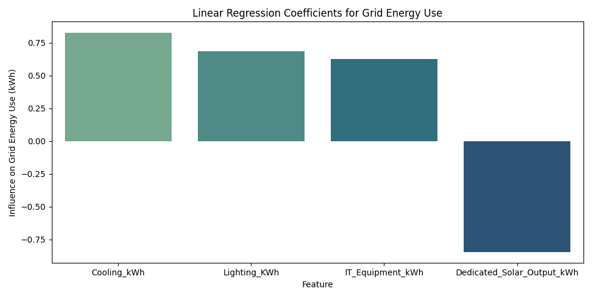

This plot shows the regression coefficients for each variable. A positive coefficient means the factor increases grid energy use, while a negative coefficient means it reduces grid energy use.

Cooling energy use has the largest positive influence on grid dependence. As cooling loads increase, grid energy use rises sharply.
Lighting and IT equipment energy use also contribute positively, though slightly less than cooling.
Solar output is the only factor with a negative coefficient, meaning higher solar generation reduces grid reliance.

This confirms that cooling efficiency is a critical driver of grid demand, likely due to the large energy loads required to maintain optimal operating conditions in the data center. IT(data cebter) equipment and lighting contribute as expected, but their relative impact is smaller. Solar generation remains the most effective countermeasure, highlighting its central role in sustainability strategy.

### Model Residuals
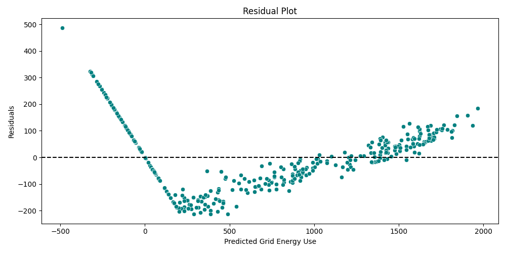

This plot shows the difference between predicted and actual grid energy use for each observation.

The points cluster closely around the zero-residual line, indicating that the model’s predictions are accurate for most days.
Some small patterns remain, with slight underestimation at lower grid energy values and slight overestimation at the highest values.

Model metrics:
R² = 0.9681: The model explains over 96% of the variance in grid energy use, meaning the selected variables capture nearly all the factors driving grid dependence.

RMSE = 122.17: The typical prediction error is about 122 kWh, which is relatively small compared to total daily grid usage.

The model is highly reliable for predicting grid energy use based on internal system metrics. 

---

## 6. Conclusions

The results show that a dedicated solar array could dramatically reduce grid dependence during high-solar months, with the data centers achieving complete renewable coverage for extended periods in late spring through early autumn. This would lead to significant annual benefits: nearly 1 million kWh of grid energy avoided, over 500,000 kg of CO₂ emissions prevented, and approximately $120,000 in cost savings. However, grid reliance would remain high during winter months, when solar generation is lowest, underscoring the need for complementary solutions such as energy storage or load shifting.

Further analysis revealed that cooling energy use is the single largest driver of grid demand, while solar generation is the most effective factor in reducing it. Operational inefficiencies, such as sporadic spikes in Power Usage Effectiveness (PUE), present additional opportunities for improvement.

Overall, this scenario demonstrates that targeted investments in dedicated renewable energy, combined with strategies to optimize cooling, add storage capacity, and align workloads with renewable availability, could substantially strengthen Middlebury’s carbon neutrality goals. Implementing these measures would position the College’s data centers as a model for how digital infrastructure can advance institutional climate commitments.

**Recommendations**

This analysis reaffirms the strength of Middlebury College’s renewable energy investments while also pointing toward clear opportunities to build on that foundation. By continuing to align operational practices with renewable availability, expanding on-site storage capacity, and addressing cooling efficiency, the College can further reduce its grid reliance, emissions, and operational costs. These steps would also reinforce Middlebury’s leadership as a carbon-neutral campus, showcasing how data centers can be central to achieving institutional climate goals.

---

## 7. Next Steps

- Model battery storage to assess ideal capacity for solar overproduction and nighttime use.
- Explore diversified renewable inputs such as small-scale wind or geothermal to reduce winter grid dependence.
- Conduct a full cooling system audit to identify inefficiencies.

---
